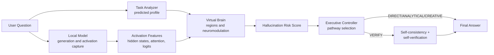

# 🧠 NeuroLLM

### A neuroscience-inspired computational model for LLM reasoning - not a claim that a language model has a brain.

NeuroLLM inspects an open-weight language model's real internal activations (hidden states,
attention, token logits) while it answers a question, combines them with deterministic text
heuristics, and routes the question through a small set of reasoning pathways - direct answer,
analytical, creative, or verify-then-possibly-abstain - based on an estimated hallucination-risk
score. Everything is visualized as an interactive "virtual brain." It began as `AI-Brain`, a purely
heuristic/behavioral prototype (see [History](#project-history) below); this version adds the
activation-based core that prototype explicitly did not have.

---

## Positioning: what this is, and what it explicitly is not

**NeuroLLM is a neuroscience-inspired computational model that maps functional properties of an
LLM's internal representations onto a virtual cognitive architecture.** It is not "an AI brain,"
and it does not claim to be one. This distinction is load-bearing, not a legal disclaimer bolted on
afterward - it shapes every design decision in this codebase.

Claims this project does **not** make:

- It does **not** claim that this language model has brain regions, hemispheres, or any anatomical structure.
- It does **not** claim that this language model has hormones, emotions, or subjective experience.
- It does **not** claim that response confidence, agreement, activation magnitude, or consistency is equivalent to correctness.
- It does **not** claim a validated, neuroscience-backed left-brain/right-brain-style split, or any other neuroscientific finding, underlies its visualizations.

What you see in the UI - "brain regions," "neuromodulation signals," pathway routing - is an
application-level metaphor layered on top of real computational signals: some are genuine tensors
read off a live forward pass through a local model (hidden-state norms, attention entropy, token
logits), others are deterministic text heuristics. Every place a region/signal name appears in the
code and UI is labeled a metaphor, not a mechanism (see `backend/app/brain/`), and every "-like"
neuromodulator name is deliberately suffixed that way so it's never read as a biological claim.

---

## Pipeline



`Task Analyzer` produces the *predicted* cognitive profile from the query text alone, before any
model call. When the local model is used, one generation pass captures real hidden states,
attention weights, and token logits; these reduce to a bounded feature summary that produces the
*measured* profile - the two are shown side by side (see Question Lab) rather than silently merged,
so the system can actually be checked against its own hypothesis that activations predict cognitive
demand.

---

## What it does

1. **Enter a question.** Typed into the Dashboard, Question Lab, Activation Explorer, Experiment Lab, or Uncertainty Lab.
2. **Task analysis.** A deterministic heuristic layer (`task_analyzer.py`) scores the query on 9 axes (complexity, logical reasoning, creativity, planning, context dependency, verification requirement, risk, ambiguity, factuality requirement) - from the text alone.
3. **Generation and activation capture.** The selected provider answers the question. If it's the local model (`local_hf`), one forward pass captures real per-layer hidden-state norms, per-layer attention entropy, and per-token entropy/probability margin.
4. **Optional multi-sample uncertainty.** If uncertainty mode is on, the provider generates several independent candidate answers; they're clustered by similarity and scored for agreement/disagreement (semantic-entropy-inspired, see [Scientific methodology](#scientific-methodology)).
5. **Virtual brain.** Predicted and measured region profiles (Language, Memory, Reasoning, Uncertainty, Verification), a Virtual Neuromodulation Layer (4 "-like" signals), and a Hallucination Risk Score are computed.
6. **Executive controller.** Chooses a pathway - DIRECT, ANALYTICAL, CREATIVE, or VERIFY - using thresholds adjusted by the neuromodulation signals. VERIFY re-checks self-consistency and runs a self-verification prompt; if risk stays high, the answer is wrapped in an explicit low-confidence framing instead of presented as settled.
7. **Category probe.** A classifier trained on real activation and heuristic features predicts the question's category (see [Probes](#probes)).
8. **Visualization and recommendation.** The frontend renders all of this as an interactive dashboard, alongside the model's actual answer.

Nothing here exposes a model's hidden chain-of-thought as if it were human reasoning. The raw
tensors captured during generation are reduced to bounded, documented feature summaries before they
ever leave the backend.

---

## Architecture

### Backend - FastAPI (Python)

All application logic lives under `backend/app/`.

| Package | Responsibility |
|---|---|
| `app/activations/` | Real activation extraction. `extractor.py` runs the actual forward/generate pass and reduces raw tensors to plain-data `ActivationCapture` (per-layer hidden-state norms, per-layer *position-normalized* attention entropy, per-token entropy/probability margin). `features.py` reduces that further to a bounded `ActivationSummary` used by the brain and probes. |
| `app/brain/` | The virtual cognitive brain. `regions.py` (5 MVP regions, predicted and measured profiles), `neuromodulation.py` (4 "-like" signals that feed back into routing thresholds), `hallucination.py` (Hallucination Risk Score), `executive_controller.py` (pathway selection and the VERIFY pathway's self-consistency/self-verification orchestration), `state_engine.py` (composes everything into the API's `CognitiveState`), `pipeline.py` (the single place that talks to a live provider - shared by chat/experiment/benchmark routes). |
| `app/cognitive_state/` | `task_analyzer.py` (9-axis text heuristics - the *predicted* profile's source), `uncertainty.py` (multi-sample response-consistency estimator), `risk_model.py` (global-state meters), `recommendations.py` (plain-language guidance). |
| `app/probes/` | `train.py` (trains logistic regression / random forest / small MLP on `data/benchmark.json`'s real activation features, writes `docs/PROBE_RESULTS.md`), `infer.py` (loads the saved probe for research-mode responses), `feature_builder.py` (shared feature-vector construction). |
| `app/llm/` | Provider abstraction. `MockProvider` (deterministic, offline, zero API keys), `OpenAIProvider` (optional), `LocalHFProvider` (Qwen2.5-1.5B-Instruct via Transformers - the only provider with an inspectable `get_activation_extractor()`). |

**Persistence**: SQLite via SQLAlchemy (`DATABASE_URL`), storing chat/experiment analyses (including
pathway and hallucination risk) for the History page.

**API surface** (all routes mounted under `/api`):

| Method | Path | Purpose |
|---|---|---|
| `POST` | `/api/chat` | Full pipeline: task analysis and generation (+ activation capture) and optional uncertainty sampling and virtual-brain routing. `research_mode=true` (with `model=local_hf`) attaches layer-by-layer detail. Persists the result. |
| `POST` | `/api/analyze` | Task analysis only (no model call). |
| `POST` | `/api/uncertainty` | Multi-sample generation and uncertainty estimate only. |
| `POST` | `/api/experiment` | Runs the full pipeline for two queries (A/B) concurrently and compares them. |
| `POST` | `/api/experiment/benchmark` | Spec's condition comparison: runs `data/benchmark.json` items through Condition 1 (direct) vs. Condition 4 (routing and verification), scoring real accuracy where an `expected_answer` exists. |
| `GET` | `/api/history` | Last 50 persisted chat analyses. |
| `GET` | `/api/probes/info` | The last trained probe's real reported accuracy/categories (or `trained: false` - never a fabricated number). |
| `GET` | `/api/health` / `/api/config` | Liveness and available models/config. |

Hardening from the original prototype is unchanged: a request body size cap and an in-memory
sliding-window rate limiter.

### Frontend - React and TypeScript

Vite and Tailwind CSS, charts via Recharts, motion via Framer Motion, icons via Lucide.

| Page | Route | Purpose |
|---|---|---|
| Dashboard | `/` | Single-query pipeline, the virtual brain, neuromodulation panel, pathway/hallucination-risk readout, and the spec's three-question demonstration (simple factual → obscure/hallucination-prone) as preset buttons. |
| Question Lab | `/question-lab` | Predicted vs. measured cognitive profile side by side, the category probe's prediction, and the executive controller's chosen pathway and reason. |
| Activation Explorer | `/activation-explorer` | Real, layer-by-layer hidden-state/attention/token charts for the local model - states plainly when data is unavailable rather than rendering a fake chart. |
| Experiment Lab | `/experiment-lab` | A/B query comparison, plus the Condition Comparison (normal vs. routed) benchmark runner. |
| Uncertainty Lab | `/uncertainty-lab` | Focused view of the multi-sample uncertainty pipeline. |
| History | `/history` | Past analyses persisted to SQLite. |
| About | `/about` | States the metaphor and scope explicitly, in-product. |

3D (Three.js/React Three Fiber) was deliberately not used for the region visualization - see
[Limitations](#limitations) - the brain map is a hand-drawn 2D SVG silhouette with animated glows.

---

## Live demo

**https://neurollm.onrender.com**

Deployed on Render's free tier via `render.yaml`. Free-tier hosting has real constraints, so what
you get there is deliberately scoped down from the full app described in this README:

- Render's free web service has 512MB RAM, not enough to run the local activation-inspectable
  model, so that deploy runs `ENABLE_LOCAL_MODEL=0` - only the offline `mock` provider is
  available. Every heuristic, routing, and visualization feature works; real activation
  extraction, Research Mode, the category probe, and retrieval-grounded verification do not,
  since none of those exist without a real model to inspect (see [Architecture](#architecture)).
- The free instance spins down after 15 minutes idle and cold-starts on the next request (10-30s).
- This is intentionally the lightweight path, not a compromise made silently: `backend/requirements-lite.txt`
  and `render.Dockerfile` are separate from the full `backend/requirements.txt`/`Dockerfile` used
  for a real deployment (a machine with enough RAM for `local_hf`, e.g. via the root `Dockerfile`)
  or local use via `run.sh`.

[](https://render.com/deploy?repo=https://github.com/shweta-rai11/NeuroLLM)

That button deploys your own copy (forked repo or otherwise) the same way - reads `render.yaml`,
no manual config.

---

## Setup & run

The app works fully with **zero API keys and zero model download** out of the box - `MockProvider`
is the default. The local model (`local_hf`) is what Research Mode / real activation inspection
actually uses, and downloads ~3GB of weights on first use.

### One command, one app (recommended)

```bash
./run.sh
```

This builds the frontend and starts the backend, which **serves both the UI and the API from a
single process on a single port**: open `http://localhost:8000`. There's no separate frontend dev
server to run or CORS to configure - `backend/app/main.py` mounts `frontend/dist` and falls back to
`index.html` for client-side routes (so a hard refresh on e.g. `/question-lab` still works), while
`/api/*` keeps working exactly as before. Set `PORT=<n>` to use a different port.

Re-run `./run.sh` (or just `cd frontend && npm run build`) after changing frontend code - it's a
static build, not hot-reloaded, in this mode.

### Two-process dev mode (hot reload)

If you're actively editing the frontend and want Vite's hot module reload, run the two dev servers
separately instead:

Backend (terminal 1):

```bash
cd backend
python3 -m venv .venv
.venv/bin/pip install -r requirements.txt   # includes torch/transformers -- a few minutes
.venv/bin/uvicorn app.main:app --reload --port 8000
```

Frontend (terminal 2):

```bash
cd frontend
npm install
npm run dev
```

The frontend dev server (Vite, default port 5173) talks to the backend at `http://localhost:8000`
via a dev-server proxy (`vite.config.ts`). In this mode, visiting `http://localhost:8000` directly
serves whatever was last built into `frontend/dist` (or the API-only JSON root note if it's never
been built) - use `http://localhost:5173` for live-reloading UI work.

### Train the category probe (optional, real numbers)

```bash
cd backend
.venv/bin/python -m app.probes.train
```

This runs the local model over every item in `data/benchmark.json` (a few minutes on CPU/MPS),
trains and compares three probe types, and writes `docs/PROBE_RESULTS.md` with the actual held-out
accuracy - Question Lab's Category Probe panel and `/api/probes/info` read from this artifact and
report `trained: false` if it hasn't been run yet, rather than inventing a number.

### iOS / Android

`frontend/ios/` and `frontend/android/` are native Capacitor projects wrapping the same web app -
see [`frontend/MOBILE.md`](frontend/MOBILE.md) for the build/sign/install walkthrough (requires
Xcode / Android Studio on your own machine) and how to point a device build at a real backend URL.

### With Docker

```bash
cp .env.example .env   # optional
docker compose build   # slow: installs torch/transformers into the backend image
docker compose up
```

Backend on `http://localhost:8000`, frontend on `http://localhost:3000`. The local model runs
CPU-only in this container (no Apple MPS passthrough) - set `ENABLE_LOCAL_MODEL=0` to hide it if
you only need `mock`/OpenAI.

There are three separate Docker paths in this repo, each for a different situation - none of them
change the others:

| File(s) | Use case |
|---|---|
| `docker-compose.yml` + `backend/Dockerfile` + `frontend/Dockerfile` | Local dev with the original two-service layout (separate backend/frontend containers). |
| `Dockerfile` (root) | Single-container deploy with the **full** app, including the local model (`backend/requirements.txt`, includes torch/transformers) - for a host with enough RAM. |
| `render.Dockerfile` + `render.yaml` | Single-container deploy for **free-tier hosts** (`backend/requirements-lite.txt`, no torch/transformers) - see [Live demo](#live-demo). |

### Environment variables

All variables are optional - the app runs entirely offline (mock provider) without any of them set.
See `.env.example` for the full list, including `ENABLE_LOCAL_MODEL`.

### Running tests

```bash
cd backend
.venv/bin/pytest tests/ -v
```

The default suite (75 tests) never downloads or loads the real model - `MockProvider` is forced via
`tests/conftest.py`, and the `local_hf`/research-mode pathway is exercised through a deterministic
`FakeLocalProvider` test double (`tests/_helpers.py`) so CI stays fast and network-free.

---

## Scientific methodology

This section is the most important part of this README. NeuroLLM sits at the intersection of
several different epistemic categories, and the project is only credible if they stay clearly
separated.

### 1. Real, directly measured signals

- **Activation extraction** (`backend/app/activations/extractor.py`): genuine tensors read off an
  actual `model.generate(..., output_scores=True)` call (per-token logits used to sample each
  token) and one additional forward pass with `output_hidden_states=True, output_attentions=True`
  (per-layer hidden states and attention weights, read at the positions the model was actually
  generating from). Nothing here is simulated; if these tensors aren't available (mock/OpenAI
  provider), the corresponding fields are `null`/absent, never a fabricated number.
- **Uncertainty estimation via multi-sample response consistency**, directly inspired by:

  > Farquhar, S., Kossen, J., Kuhn, L. & Gal, Y. "Detecting hallucinations in large language models using semantic entropy." *Nature* 630, 625–630 (2024).

  This project's implementation (`backend/app/cognitive_state/uncertainty.py`) is a **simplified
  approximation** - it clusters answers by TF-IDF/lexical similarity rather than NLI-based
  bidirectional entailment, and estimates entropy from cluster-size distribution rather than
  token-level output-distribution probabilities. Treat it as a rough, relative signal.
- **Probe training** (`backend/app/probes/train.py`): a real train/test split evaluated against
  real captured activations, with results written to `docs/PROBE_RESULTS.md` - never hardcoded.

### 2. Designed metaphor / heuristic (not established science)

- The five virtual "brain regions" (`brain/regions.py`) and their predicted/measured weighting
  formulas.
- The four "-like" neuromodulator signals (`brain/neuromodulation.py`) and how they adjust routing
  thresholds in `brain/executive_controller.py`.
- The Hallucination Risk Score's weighting (`brain/hallucination.py`).
- The Language ↔ early/mid-layer, Reasoning ↔ late-layer association used to blend region scores is
  a **documented design heuristic** drawn from general, informal mechanistic-interpretability
  observations - it is not a validated, per-layer finding produced by this codebase for this
  specific model.

No anatomical, physiological, or neurochemical correspondence is claimed or implied for any of the
above - see [Positioning](#positioning-what-this-is-and-what-it-explicitly-is-not).

### 3. Open experimental hypotheses (spec section 21)

- **H1** - internal activation patterns predict cognitive requirements: testable via Question Lab's
  predicted-vs-measured comparison; not validated at scale here.
- **H2** - activation-based uncertainty predicts hallucination risk: the Hallucination Risk Score is
  the mechanism, not a validated calibration.
- **H3** - activation-informed routing and verification improves reliability over direct generation:
  the Condition Comparison in Experiment Lab is a small, real, bounded test of this (see `data/README.md`
  for exactly which categories are objectively scoreable) - not a benchmark-scale result.

  Example real run (`local_hf`, 3 items/category, via `/api/experiment/benchmark`):

  | Category | n | Normal accuracy | Routed accuracy | Mean hallucination risk |
  |---|---|---|---|---|
  | factual | 3 | 100% | 100% | 0.20 |
  | mathematical | 3 | 33% | 33% | 0.11 |
  | logical | 3 | 100% | 100% | 0.12 |
  | hallucination_prone | 3 | n/a (no ground truth) | n/a | 0.42 |

  Read honestly: on this tiny sample, routing didn't change accuracy on the checkable categories
  (both conditions used the same underlying answer for most items here - the router only intervenes
  when its risk threshold is crossed) - but every `hallucination_prone` item correctly triggered the
  VERIFY pathway with a visibly elevated risk score, and the mathematical failures (17×24 correct;
  144÷12 and 15% of 200 both wrong) are a genuine limitation of the 1.5B model's arithmetic, not a
  harness bug. This is the kind of result this comparison is for - surfacing real behavior,
  including where routing doesn't yet help, not a validated win.
- **H4/H5** (functional-specialization framework value; lateralization) are **not implemented** in
  this MVP - see [Limitations](#limitations).

---

## Probes

`backend/app/probes/train.py` trains a category classifier (logistic regression, compared against a
random forest and a small MLP) on `data/benchmark.json`, using each question's heuristic task scores
concatenated with real activation-feature statistics (`backend/app/probes/feature_builder.py`).
Results are written to `docs/PROBE_RESULTS.md` from an actual run - see that file for the current
real numbers (accuracy, confusion matrix). The benchmark is intentionally small (~50 items across 10
categories), so treat the reported accuracy as a demonstration of the methodology, not a validated
classifier.

---

## Limitations

- **Task scoring is heuristic, not psychometric.** `task_analyzer.py` uses keyword/structural
  pattern matching, not a validated instrument.
- **The region/neuromodulation weighting formulas are designed, not learned or validated** against
  any neuroscience ground truth.
- **Uncertainty is a consistency signal, not a calibrated probability** - an ensemble can agree
  confidently and still be wrong.
- **The self-verifier is the same model critiquing its own candidates** - a useful signal, not
  ground-truth verification.
- **No external retrieval pathway exists in this MVP.** The Memory region's "measured" score
  inherits its "predicted" value verbatim, and the Hallucination Risk Score's retrieval-disagreement
  term is fixed at weight 0 - both documented, not silent.
- **The probe is trained on a small (~50-item) hand-authored benchmark** - see `data/README.md`.
- **The mock provider is synthetic** - deterministic, template-based text, not real model outputs,
  and has no inspectable activations.
- **Persistence and rate limiting are demo-grade** (single SQLite file, in-process rate limiter).
- **No 3D visualization, no external retrieval, no PostgreSQL/WebSockets, no
  Captum/TransformerLens/SAE integration, and no lateralization-index experiment** - all explicitly
  out of scope for this MVP pass (see below).

---

## Future work

- **Lateralization experiment** (spec section 7): an empirically-defined left/right-analogue
  activation grouping, not a hand-declared layer split.
- **External retrieval pathway**: would let Memory's "measured" score and the Hallucination Risk
  Score's retrieval-disagreement term become real rather than inert.
- **3D visualization** (React Three Fiber) as an alternative to the current 2D SVG brain map.
- **Larger, more diverse benchmark** for probe training and the condition comparison, plus
  cross-validation instead of a single train/test split.
- **Model comparison**: run the same pipeline across multiple real local/hosted models.
- **Mechanistic-interpretability tooling** (Captum, TransformerLens, sparse autoencoders) for
  deeper per-neuron/per-head analysis than the current per-layer summary statistics.
- **Human trust-calibration study**: whether this visualization actually helps someone calibrate
  trust in an answer is untested - a controlled study (control: plain answer; treatment: this UI)
  measuring hallucination-detection rate, over/under-trust, and decision accuracy would test it.

---

## Project history

`ai-brain` (this repository, formerly positioned as "AI-Brain") began as a purely heuristic and
behavioral prototype: task scoring from text alone, and "uncertainty" derived only from
multi-sample response clustering - it explicitly never inspected model internals. NeuroLLM keeps
that layer (as the *predicted* profile and the uncertainty engine) and adds the activation-based
core described throughout this README as the *measured* profile, the probes, the Hallucination Risk
Score, and the executive controller.

---

## References

Farquhar, S., Kossen, J., Kuhn, L. & Gal, Y. "Detecting hallucinations in large language models using semantic entropy." *Nature* 630, 625–630 (2024).

Qwen2.5 Technical Report - Qwen Team, Alibaba Group. Model card: `Qwen/Qwen2.5-1.5B-Instruct` on Hugging Face.

This project's design also nods to general LLM-observability and mechanistic-interpretability
conventions (per-call token usage/latency, layer-wise activation summaries) as informal prior art
rather than a specific cited system.

---

## License

Released under the MIT License - see [`LICENSE`](./LICENSE).
